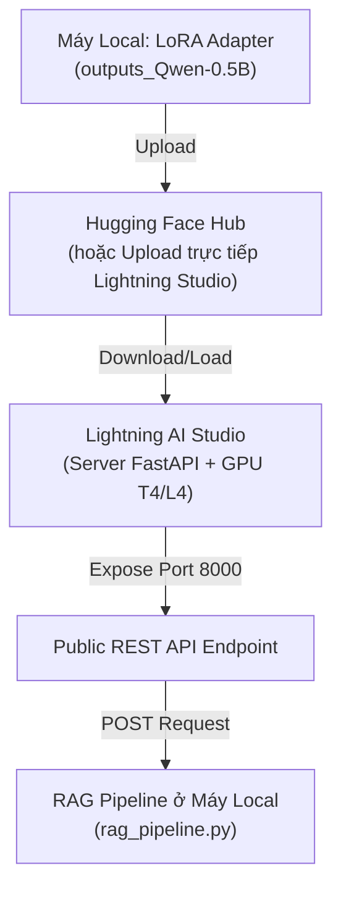

# Hướng Dẫn Từ A-Z: Deploy Model Qwen-0.5B Fine-Tuned Lên Lightning AI Với FastAPI

Tài liệu này hướng dẫn chi tiết từng bước giúp bạn đưa model **Qwen-0.5B** đã fine-tune (LoRA Adapter) lên **Lightning AI Studio**, dựng REST API bằng **FastAPI** sử dụng GPU và tích hợp vào hệ thống RAG ở máy local.

---

## 📋 Tổng Quan Quy Trình



---

## 🚀 BƯỚC 1: Chuẩn Bị File Adapter & Upload Lên Hugging Face Hub (Khuyên Dùng)

Để Lightning AI Studio tải weights nhanh chóng mà không cần tốn công upload tay file dung lượng lớn qua web UI, bạn nên đẩy thư mục LoRA Adapter lên một repo Hugging Face (Public hoặc Private).

### 1.1. Cài đặt `huggingface_hub` ở máy local
```bash
pip install huggingface_hub
```

### 1.2. Đăng nhập Hugging Face CLI
```bash
hf auth login
# Nhập Access Token (lấy từ https://huggingface.co/settings/tokens - chọn Write token)
```

### 1.3. Upload thư mục Adapter lên Hugging Face Hub
Chạy đoạn script Python sau tại máy local:

```python
from huggingface_hub import HfApi

api = HfApi()

# Đổi thành tên tài khoản và tên repo bạn muốn tạo
repo_id = "your-username/qwen-0.5b-nursing-adapter" 

# Tạo repository trên Hugging Face
api.create_repo(repo_id=repo_id, exist_ok=True, private=True)

# Upload toàn bộ file trong thư mục adapter (chứa adapter_model.safetensors, adapter_config.json...)
api.upload_folder(
    folder_path="e:/AI_VTD/MockProject_062026_NhomAI/train/outputs_Qwen-0.5B",
    repo_id=repo_id,
    repo_type="model"
)
print(f"✅ Đã upload thành công lên: https://huggingface.co/{repo_id}")
```

---

## ⚡ BƯỚC 2: Khởi Tạo Môi Trường Trên Lightning AI Studio

### 2.1. Tạo Studio mới
1. Truy cập [Lightning AI Studio](https://lightning.ai/) và đăng nhập.
2. Nhấn nút **New Studio**.
3. Đặt tên Studio (ví dụ: `qwen-llm-service`).
4. Tại mục chọn phần cứng (Hardware), chọn **T4 GPU** hoặc **L4 GPU** (tận dụng Free Monthly Credits).

### 2.2. Mở Terminal và cài đặt Dependencies
Mở tab **Terminal** trên giao diện Lightning Studio và chạy lệnh:

```bash
pip install torch torchvision torchaudio --index-url https://download.pytorch.org/whl/cu121
pip install transformers peft fastapi uvicorn pydantic huggingface_hub accelerate
```

---

## 🛠️ BƯỚC 3: Viết Mã Nguồn FastAPI Server trên Lightning Studio

Tạo một file có tên **`server.py`** trong thư mục làm việc của Lightning Studio.

### Mã nguồn `server.py`:

```python
import os
from contextlib import asynccontextmanager
from fastapi import FastAPI, HTTPException
from pydantic import BaseModel
import torch
from transformers import AutoModelForCausalLM, AutoTokenizer
from peft import PeftModel
from huggingface_hub import login

# ---------------------------------------------------------
# CONFIGURATION
# ---------------------------------------------------------
# Tên base model trên Hugging Face
BASE_MODEL_ID = "Qwen/Qwen2.5-0.5B-Instruct"

# Tên repo Adapter bạn đã upload ở Bước 1 (hoặc đường dẫn local trong Studio)
ADAPTER_ID = "your-username/qwen-0.5b-nursing-adapter"

# Nhập HF Token nếu repo Adapter là Private (để trống nếu Public)
HF_TOKEN = os.getenv("HF_TOKEN", "")

# Biến toàn cục lưu trữ Model & Tokenizer
models = {}


@asynccontextmanager
async def lifespan(app: FastAPI):
    """Quản lý vòng đời ứng dụng: Load model khi startup, giải phóng khi shutdown."""
    print("⏳ Đang khởi tạo và nạp Model vào GPU...")
    
    if HF_TOKEN:
        login(token=HF_TOKEN)
        
    device = "cuda" if torch.cuda.is_available() else "cpu"
    print(f"🖥️ Thiết bị tính toán: {device}")
    
    # 1. Load Tokenizer
    tokenizer = AutoTokenizer.from_pretrained(
        ADAPTER_ID, 
        token=HF_TOKEN if HF_TOKEN else None,
        trust_remote_code=True
    )
    
    # 2. Load Base Model với bfloat16 / float16 để tối ưu VRAM
    base_model = AutoModelForCausalLM.from_pretrained(
        BASE_MODEL_ID,
        torch_dtype=torch.float16,
        device_map="auto",
        trust_remote_code=True
    )
    
    # 3. Load LoRA Adapter và merge nhẹ
    model = PeftModel.from_pretrained(
        base_model, 
        ADAPTER_ID,
        token=HF_TOKEN if HF_TOKEN else None
    )
    model.eval()
    
    models["model"] = model
    models["tokenizer"] = tokenizer
    print("✅ Model Qwen-0.5B Fine-tuned đã được nạp thành công!")
    yield
    models.clear()


app = FastAPI(
    title="Qwen-0.5B Nursing AI API",
    description="REST API cho model Qwen-0.5B Fine-tuned phục vụ RAG Pipeline",
    lifespan=lifespan
)


# ---------------------------------------------------------
# REQUEST / RESPONSE SCHEMAS
# ---------------------------------------------------------
class GenerateRequest(BaseModel):
    prompt: str
    max_new_tokens: int = 512
    temperature: float = 0.1
    top_p: float = 0.9


class GenerateResponse(BaseModel):
    answer: str
    status: str = "success"


# ---------------------------------------------------------
# ENDPOINTS
# ---------------------------------------------------------
@app.get("/")
async def health_check():
    return {"status": "online", "model": BASE_MODEL_ID, "adapter": ADAPTER_ID}


@app.post("/generate", response_model=GenerateResponse)
async def generate_text(req: GenerateRequest):
    if "model" not in models or "tokenizer" not in models:
        raise HTTPException(status_code=503, detail="Model chưa sẵn sàng.")
    
    try:
        model = models["model"]
        tokenizer = models["tokenizer"]
        
        # Tokenize input prompt
        inputs = tokenizer(req.prompt, return_tensors="pt").to(model.device)
        
        # Inference không ghi nhận gradient để tiết kiệm GPU VRAM
        with torch.no_grad():
            outputs = model.generate(
                **inputs,
                max_new_tokens=req.max_new_tokens,
                temperature=req.temperature,
                top_p=req.top_p,
                do_sample=True if req.temperature > 0 else False,
                pad_token_id=tokenizer.eos_token_id
            )
            
        # Giải mã kết quả (loại bỏ phần prompt lặp lại ở đầu)
        input_len = inputs.input_ids.shape[1]
        generated_tokens = outputs[0][input_len:]
        response_text = tokenizer.decode(generated_tokens, skip_special_tokens=True)
        
        return GenerateResponse(answer=response_text.strip())
        
    except Exception as e:
        print(f"❌ Lỗi sinh câu trả lời: {str(e)}")
        raise HTTPException(status_code=500, detail=str(e))
```

---

## 🌐 BƯỚC 4: Khởi Chạy Server & Public Port (Expose Endpoint)

### 4.1. Lệnh khởi chạy Uvicorn Server
Trong Terminal của Lightning AI Studio, chạy lệnh:

```bash
uvicorn server:app --host 0.0.0.0 --port 8000
```
*(Nếu repo Adapter của bạn là Private, hãy truyền token:* `HF_TOKEN="hf_xxx" uvicorn server:app --host 0.0.0.0 --port 8000`*)*

Khi màn hình hiện `✅ Model Qwen-0.5B Fine-tuned đã được nạp thành công!`, server của bạn đã khởi chạy xong.

### 4.2. Public Port 8000 ra ngoài Internet
1. Trên giao diện **Lightning AI Studio**, quan sát thanh công cụ bên phải chọn nút **Plugin -> Ports**.
2. Thêm Port `8000`.
3. Bấm vào dòng `NHMS_qwen-0.5B` vừa tạo để mở tab mới và copy URL Public.

---

## 🧪 BƯỚC 5: Kiểm Tra API Endpoint

Bạn có thể test API vừa tạo bằng cURL hoặc Python ở máy local.

```bash
curl -X POST "https://8000-xxxx-xxxx.cloudspaces.litng.ai/generate" \
     -H "Content-Type: application/json" \
     -d '{"prompt": "Hãy giải thích ngắn gọn về chăm sóc bệnh nhân cao tuổi.", "temperature": 0.1}'
```

---

## 🔗 BƯỚC 6: Tích Hợp Vào RAG Pipeline Ở Máy Local (`config.py`)

Trong dự án `MockProject_062026_NhomAI`, mở file `Embedding_RAG/all-MiniLM-L6-v2/config.py` và cập nhật:

```python
LIGHTNING_API_URL = "https://8000-xxxx-xxxx.cloudspaces.litng.ai/"
LLM_PROVIDER = "lightning"
```

Sau đó chạy script test tương tác:
```bash
python Embedding_RAG/all-MiniLM-L6-v2/chat_cli.py
```
